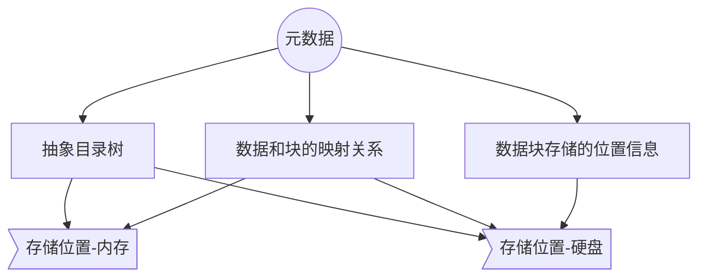
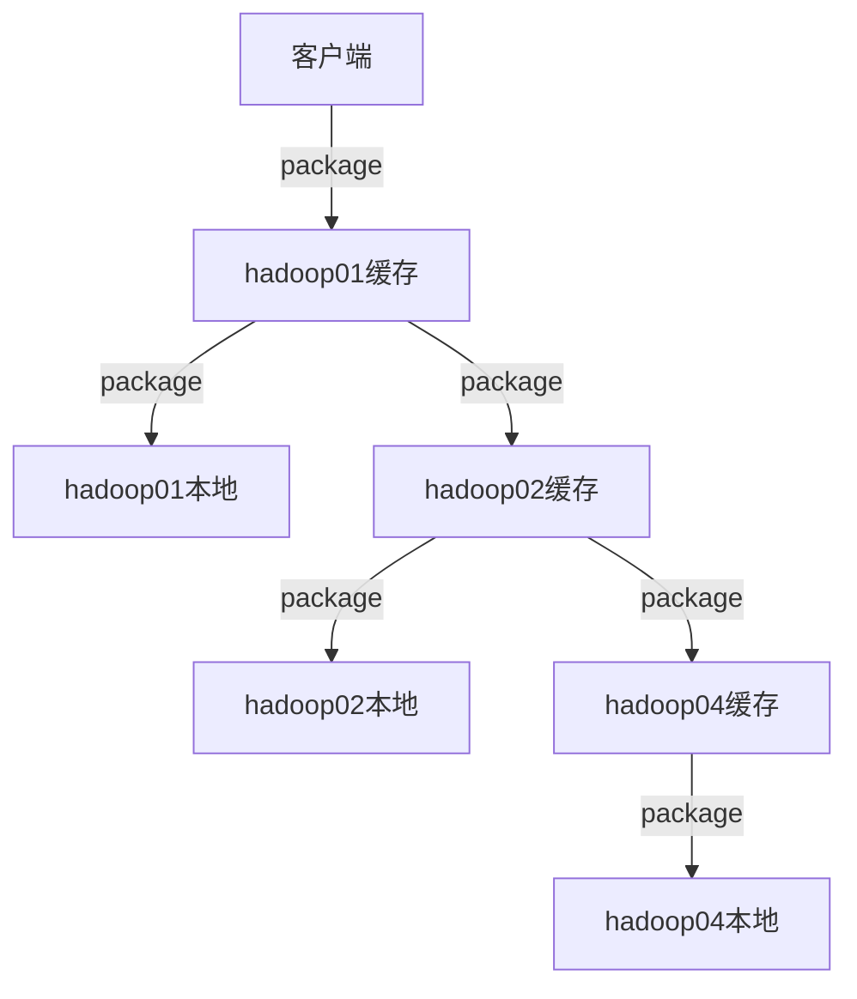

#	HDFS的四大机制和两大核心

[TOC]


hdfs提供的是高容错性的分布式的数据存储方案
*	四大机制：

```
*	心跳机制(heartbeat)
*	安全模式
*	机架策略
*	负载均衡
```

*	两大核心：

```
*	上传
*	下载
*	（元数据的管理）
```

## hdfs集群启动各进程启动的顺序：

*	**namenode-->datanode-->secondarynamenode;**


## 四大机制
### 心跳机制heartbeat
*	集群节点之间必须时间同步
要求：主节点namenode必须知道各从节点datanode的存活状态

*	确定从节点存活状态的方式：
**datanode定期得向namenode发送心跳报告**，目的是告诉namenode自己的状态
默认情况下心跳间隔由配置文件中的参数决定：
```xml
<property>
	<name>dfs.heartbeat.interval</name>
    <value>3</value>
</property>
```

  datanode每隔3s向namenode发送一次心跳报告，当namenode连续10次没有收到datanode的心跳报告，并不能确定datanode宕机。
  此时namenode会主动向datanode发送一次检查，发送一次检查的时间是5min，直到发送了**2次**检查仍没收到回复时，namenode才判定datanode宕机。
默认情况下检查时间发送间隔由配置文件中的参数决定：
```xml
<property>
	<name>dfs.namenode.heartbeat.recheck-interval</name>
    <value>300000</value>
</property>
```

*	namenode判断datanode宕机需要10*3s+2*5min=630s

### 安全模式
####	启动的时候namenode需要完成的事情：

*	元数据：
1.	**抽象目录树**	
2.	**数据和块的映射关系** 如hadoop.tar.gz &emsp; blk_4262727 &emsp;blk_6271281
3.	**数据块存储的位置信息**


*	元数据存储的位置：
1.	**内存**：读写快，关机数据会丢失，内存中存储元数据的1，2和3。
2.	**硬盘**：读写性能较差，用于集群启动之后读取硬盘的元数据，存储元数据的1和2。



####	**集群启动过程细节：**
1.	集群第一次启动，会将硬盘元数据加载到内存中，这里加载的只有元数据的抽象目录树和数据和块的映射关系。
2.	然后通过datanode的心跳机制获取元数据的数据块存储的位置信息：namenode会接受datanode的心跳报告，从而获得datanode的数据块的存储状况。

####	**集群启动后：**
1.	namenode启动，将元数据加载到内存中；
2.	datanode启动，namenode接受datanode的心跳报告:1）获取datanode的存活状况  2）获取块的存储信息
3.	启动secondarynamenode

####	**安全模式：集群处于维护或升级或处于加载元数据和获取心跳报告的状态**
集群在执行过程中不允许外界对集群进行操作，这个时候集群处于安全模式

```
	hdfs dfsadmin -safemode enter	进入安全模式
    hdfs dfsadmin -safemode leave	退出安全模式
    hdfs dfsadmin -safemode get	  获取安全模式的状态，ON代表开启，OFF代表关闭
    hdfs dfsadmin -safemode wait	 等待自行退出安全模式
```
####	安全模式下的操作权限
*	**可以进行的操作：不修改元数据的操作**
	如：ls查询	cat查看文件内容	get下载
*	**不可以进行的操作：修改元数据**
	如：创建目录	上传	修改文件名	文件追加

### 机架机制rack

副本存放策略：
    1.	第一个副本一般存储在客户端所在的节点上
    2.	第二个副本存储在和第一个副本不同的机架上的任意一个节点上
    	原因：防止同一个机架断，数据无法访问
    3.	第三个副本存储在和第一个副本相同机架上的不同节点上
    	原因：在风险度相同的情况下，优先选择网络传输少的

机架策略需要手动**自定义**配置:
*	不同节点
*    不同机架
*    不同数据中心

### 负载均衡
定义：**每个节点上存储的数据百分比相差不大**
*	在进行文件上传时会优先选择客户端所在节点（如果习惯性使用一个客户端会造成所在节点的存储数据过多，但是）
*	集群会有一个自动的负载均衡的操作，只是该操作比较慢(参数显示在集群空闲的情况下，会默认以**1M/s**的带宽进行负载均衡)
```xml
<property>
	<name>dfs.datanode.balance.bandwidthPerSec</name>
    <value>1048576</value>
</property>
```

手动进行负载均衡：**start-balancer.sh**
start-balancer.sh -t 10%: 指的是任意两个节点之间的存储百分比不超过10%。

## 两大核心
###	hdfs文件上传流程
####	上传步骤
1. **客户端向namenode发送数据上传的请求**
2. **namenode接收到客户端的请求后会进行一系列的检查工作**：
	*	文件是否存在
	*	上传文件的父目录是否存在
	*	检查权限

3. **namenode检查通过，会向客户端返回应该存储的节点信息**
	*	原则：就近原则
	（1）优先返回客户端所在节点
	（2）返回同机架的节点
	（3）再返回不同机架的节点
	blk_01:hadoop01 &emsp;	hadoop02 &emsp; hadoop04
	blk_02:hadoop01 &emsp; hadoop03 &emsp; hadoop04

4.	**客户端接收到namenode返回的响应后，会进行一次逻辑切块**
	切块：
	*	物理切块：真实的切分
	*	逻辑切分：概念的切分，做切分的规划(物理切分之前的准备)
	blk_01:0-127
	blk_02:128-

5.	**开始准备文件上传**
6.	**根据块ID构建pipeline通道：将同一个块的所有存储节点构建成一个数据流通道**

	以blk_01:hadoop01 &emsp; hadoop02 &emsp; hadoop04为例：

blk_02需要另外重新构建pipeline通道

7.	**开始真正进行文件上传**
	*	文件上传过程中边上传边进行块的切分
	*	上传的时候以package为单位进行文件上传512KB
	*	上传的过程先写入到datanode01的缓存中，缓存中每接收到一个package就可以向下一个节点传递，并且同时向当前节点的硬盘写数据。



8.	**当第一个块数据上传完成，通道关闭**
9.	**上传第二个块，重复6,7,8**
10.	**所有的块上传完成后会向客户端返回结果，数据上传成功**
11.	**客户端向namenode返回上传成功信息**
12.	**namenode更新元数据**

_ _ _
####	上传出错解决方案
文件上传重若出现一个失败节点，在重试一次仍失败后，将会把失败节点剔除pipeline并报告给namenode
hdfs最终可以忍受至少一个节点成功，在这种情况下会向namenode重新申请构建pipeline，剩下的副本在集群上传成功后进行异步复制

###	hdfs文件下载流程
####	下载步骤
1.	**客户端向namenode发送文件下载请求**
2.	**namenode在自己的元数据库查询**
	查询成功返回数据块及副本存储节点：
    blk_01:hadoop01 &emsp;	hadoop02 &emsp; hadoop04
	blk_02:hadoop01 &emsp; hadoop03 &emsp; hadoop04
3.	**客户端得到数据块的存储节点**：**就近原则**
4.	**第一个块下载完成后生成一个crc文件，与上传的.meta文件进行文件完整度校验**
5.	**完成剩下的块的下载，直至所有块下载成功后，向那么浓的发送数据下载成功响应**

###	元数据管理
/home/hadoop/data/hadoopdata目录下有3个文件夹：
*	data：数据的真实存储目录，datanode存储数据的存储目录
*	name：namenode存储元数据的目录
*	nm-local-dir：hdfs的本地缓存

####	元数据存储目录

cd /home/hadoop/data/hadoopdata/**name**/**current**
出现三类文件类型：

1.	**历史日志文件**
	日志文件：记录客户端对元数据操作的日志。如某一个用户对某一个目录执行某一种操作
    edits_0000000000000000001-0000000000000000002
    edits_0000000000000000003-0000000000000000006
    edits_0000000000000000007-0000000000000001813
    
2.	**正在编辑的日志文件：目前对元数据修改的操作记录文件**
	edits_inprogress_0000000000000001814
3.	**镜像文件：真实的元数据信息经过序列化之后的文件**
	集群启动会加载这个镜像文件，加载时会进行反序列化
	fsimage_edits_0000000000000001945	&emsp; &emsp;&emsp;镜像文件序列化后的文件
    fsimage_edits_0000000000000001945.md5	&emsp; 镜像文件序列化后的加密文件
    
4.	**seen_txid:合并点记录文件，记录下一次需要合并的日志文件**

hdfs格式化时只有：
fsimage_edits_0000000000000001945
fsimage_edits_0000000000000001945
seen_txid

当集群第一次启动时会生成一个正在编辑的日志文件（edits_inprogress_)


当对元数据进行修改（如hadoop fs -mkdir/put/rename)
1.	先将操作写入硬盘的日志文件中
2.	将操作写入到内存，修改内存的元数据

*	内存中保留的元数据永远是最新最完整的元数据
*	硬盘上存储完整的元数据：fsimage+正在编辑的日志文件。**合并是由secondarynamenode完成**

####	checkpoint过程
checkpoint：**元数据合并**
原因：如果fsimage不和日志文件合并，fsimage和内存元数据的差别就越来越大，因此fsimage和日志文件需要定期合并
*	secondarynamenode完成合并过程

#####	触发合并的条件：满足以下两个条件之一即可
1.	时间节点 &emsp;时间间隔3600s=1hours
```xml
<property>
	<name>dfs.namenode.checkpoint.period</name>
    <value>3600</value>
</property>
```
2.	元数据条数 &emsp;100w条
```xml
<property>
	<name>dfs.namenode.checkpoint.txns</name>
    <value>1000000</value>
</property>
```

#####	合并过程
1.	secondarynamenode向namenode**发送请求**是否需要checkpoint

2.	满足触发条件，namenode向secondarynamenode**返回响应需要**checkpoint
3.	secondarynamenode向namenode**发送执行checkpoint**

4.	namenode将正在编辑的**日志文件回滚**，同时生成一个新的正在编辑的日志文件edites_inprogress.new

5.	secondarynamenode将历史日志文件和fsimage文件**拉到secondarynamenode节点**上。
	注意：如果不是第一次checkpoint，则这次拉去的日志文件是合并点记录的日志文件编号到最新回滚日志文件区间的所有日志文件。
    合并过程**：根据edites的操作日志改变fsimage的元数据信息**
	```mermaid
		graph TD;
		edites1-->合并点到最新日志之间的所有日志文件;
		edites2-->合并点到最新日志之间的所有日志文件;
		edites3-->合并点到最新日志之间的所有日志文件;
		edites4-->合并点到最新日志之间的所有日志文件;
        合并点到最新日志之间的所有日志文件-->内存((内存));
		fsimage-->内存((内存));
        内存((内存))-->|合并|fsimagecheckpoint;
	```
6.	secondarynamenode将edits和fsimage文件**加载到内存中进行合并**，合并完成命名为fsimage.checkpoint

7.	secondarynamenode将合并完成的fsimage文件**发送到namenode**

8.	namenode将fsimage.checkpoin**t重命名为fsimage并替换原来的fsimage文件**


_ _ _

###	总结
####	namenode的作用：
1.	保存元数据
2.	处理客户端的读写请求
3.	负责分配数据块的存储节点
4.	负载均衡


####	secondarynamenode的作用：
1.	帮助namenode做元数据备份，帮助namenode进行恢复
2.	进行checkpoint，帮助namenode进行元数据合并


####	datanode的作用：
1.	用来存储数据块
2.	处理真正的读写
3.	定期向namenode发送心跳报告（状态，块信息位置）

####	块的位置信息补充：
1.	数据块存储在datanode上，每个datanode只知道自己节点上的数据块，不知道数据块分别属于哪一个文件，namenode才知道数据块和文件的映射关系
2.	namenode记录的元数据信息按如下格式存储：
	文件：blk_1:[]
    &emsp;&emsp;&emsp;blk_2:[]
        数据块的存储信息会存为一个空的列表，*在datanode向namenode发送块报告时会把对应块的存储节点添加到列表中*
